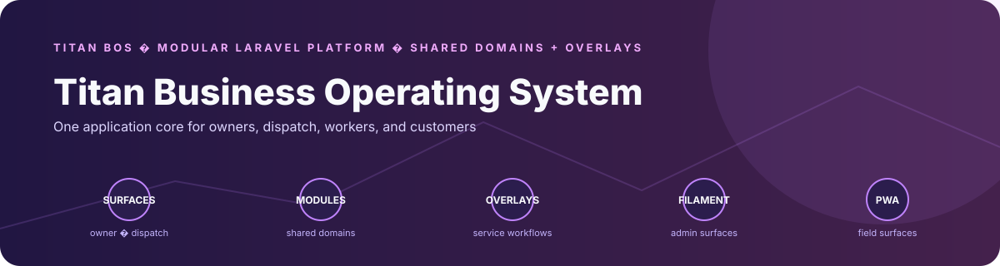
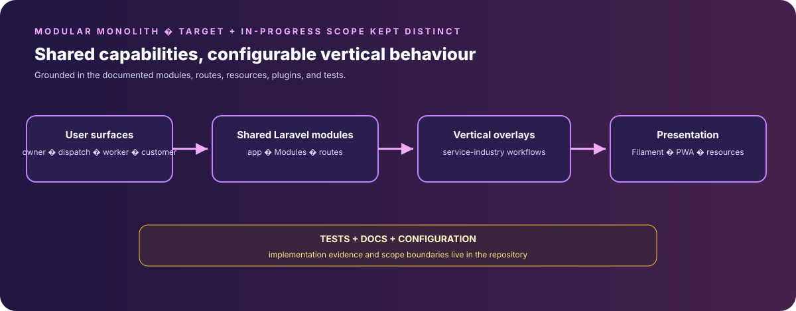

# Titan Zero Modular Business Platform

> **Titan BOS. Zero BS.**

A Laravel application and product-development workspace for a modular business operating system aimed at cleaning and adjacent service industries. The repository documents a broader target architecture; the feature descriptions below are product direction and should not be read as a verified production-readiness checklist.

---

## Product architecture and engineering highlights

<p align="center">
  
</p>

A Laravel modular business-platform codebase organized around shared operational domains, multiple user surfaces, and configurable service-industry workflows.

- **Architecture:** The documented target maps nine product surfaces onto shared backend modules, with vertical overlays intended to vary terminology and workflows without forking the core. The repository contains Laravel modules, migrations, Filament resources, and PWA-oriented application code.
- **Distinctive engineering:** The differentiator is a modular-monolith approach: shared business capabilities can serve owner, dispatch, worker, and customer experiences while vertical behaviour is expressed as configuration. Product-scope descriptions below identify architecture direction, not a claim that every surface is complete.

## Project status

This repository is the **Titan BOS application source**. It is a substantial Laravel codebase with architecture documentation, modules, and tests. The broader product scope described here includes planned and in-progress work; individual capabilities, integrations, security controls, and performance claims require verification against implementation and test results before being represented as production-ready. No commercial pricing is established by this repository README.

## What It Is

Titan BOS is intended to consolidate workflows that might otherwise use separate tools. The mapping below describes the product direction, not a verified feature-equivalence claim:

| Replaces | With |
|---|---|
| Scheduling software (Jobber, ServiceM8) | Ground Zero + Titan Go |
| Customer portal | Zero Fuss |
| Marketing platform (Mailchimp + social) | Titan Studio |
| Communication tools (Intercom, Twilio) | Titan Hello |
| Invoicing & accounting sync | ZeroPay |
| AI assistant | Titan Zero (BYO API key) |
| Document generation | TitanDocs (built-in) |

Any comparison with third-party pricing or savings needs current, region-specific research and a verified product feature set; no savings or price guarantee is made here.

---

## Product principles

These are design goals, not service-level guarantees:

- **Reliable response handling** — route calls and messages with explicit escalation paths
- **Transparent costs** — disclose platform and provider charges before offering a paid plan
- **Portability** — document supported export and provider-configuration paths
- **Privacy controls** — define data retention and model-provider handling clearly
- **Configurable verticals** — prefer shared modules and configuration where practical
- **Simple workflows** — reduce unnecessary steps and make operational state visible

---

## 9 Nodes

Each node is a purpose-built surface over the same shared backend modules.

| Node | Role | Type |
|---|---|---|
| **Titan Pro** | Owner / Director command centre | Filament Admin Panel |
| **Ground Zero** | Real-time dispatch control | Filament Panel |
| **Titan Go** | Field operator / cleaner on-site | Mobile PWA (offline-first) |
| **Zero Fuss** | Customer self-service portal | PWA |
| **Titan Zero** | AI orchestration + embedded AI | Chat surface + API |
| **ZeroPay** | Invoicing, payments, cashflow | PWA |
| **Titan Studio** | Marketing, content, lead funnel | Filament Panel |
| **Titan Solo** | Single-operator simplified mode | PWA |
| **Titan Hello** | Omni-channel receptionist | Background system |

---

## 19 Vertical Overlays

Each vertical is a config layer — not a code fork. Same platform, industry-native experience.

**Tier 1 — Core Cleaning**
Residential · Commercial & Office · Bond (End-of-Lease) · Airbnb / Short-Stay · Construction Site

**Tier 2 — Specialist High-Margin**
Biohazard & Crime Scene · Medical Equipment · Solar Panel (Industrial) · Industrial Window

**Tier 3 — Property & Exterior**
Pool Maintenance · Garden & Grounds · Property Manager Partner · Pressure Cleaning

**Tier 4 — Mobile Specialty**
Car Detailing · Pet Washing & Grooming · Oven / Appliance Deep Cleaning

Each overlay injects: terminology translation · workflow lifecycle model · compliance gates · checklists · artefact generators · AI knowledge pack.

---

## Tech Stack

| Layer | Technology |
|---|---|
| Framework | Laravel 12, PHP 8.4 |
| Module system | nwidart/laravel-modules 10.x |
| Admin panels | Filament 4 |
| AI surfaces | Chatbot provider adapters and tool-call loop; bounded InstantAds/EInvoice adapters; TitanZero remains a scaffold |
| Real-time | Pusher + Laravel Echo |
| Communications | Twilio (voice/SMS), Vonage, Telegram, OneSignal |
| Payments | Stripe · Square · PayID · PayPal · Razorpay · Mollie · BPAY |
| E-invoicing | PEPPOL / UBL (EInvoice module) |
| Document generation | DomPDF + custom TitanDocs engine |
| Storage | AWS S3 / local via Flysystem |
| Queue | Laravel queues (database / Redis) |
| Auth | Laravel Fortify + Sanctum |
| Search | Meilisearch / Scout-compatible |

---

## Architecture

```
Titan BOS
├── 9 Node surfaces (Filament panels + PWAs)
│   └── Each node reads/writes shared backend modules
├── 37 Backend modules (Modules/)
│   └── Each module: migrations, services, events, jobs, manifests, Filament plugin
├── Vertical Overlay System
│   └── Config injection at boot — no code forks
├── Implemented AI surfaces
│   ├── plugins/filament-chatbot/ — provider adapters, tool definitions, bounded run processor
│   ├── Modules/InstantAds/ — bounded OpenAI copy/image integrations with fallbacks
│   └── Modules/EInvoice/AI/ — invoice-oriented OpenAI adapter
├── TitanZero module scaffold
│   └── Modules/TitanZero/ currently contains metadata/lifecycle manifests, not a central query runtime
└── AI architecture documentation
    └── docs/04-AI/ and docs/architecture/ describe the target governance and routing model
```

**Implementation boundary:** the repository currently contains both a reusable chatbot driver/tool loop and bounded direct-provider feature adapters. The documented single `TitanZero::query()` gateway is a target architecture, not an implemented invariant. No node forks backend code, and vertical behaviour remains configuration-driven.

---

## Implemented AI surface map

- `plugins/filament-chatbot/src/Drivers/` normalises OpenAI-compatible, Anthropic, and Gemini APIs behind one driver contract.
- `plugins/filament-chatbot/src/Services/RunProcessorService.php` persists runs and handles tool calls for up to five iterations before failing closed.
- `Modules/InstantAds/Services/AdCopyService.php` and `AIChatImageService.php` provide bounded marketing-generation features, including fallback behaviour when provider configuration is absent.
- `Modules/EInvoice/AI/` contains invoice-specific AI code; it is a feature adapter, not the central TitanZero gateway.
- `Modules/TitanZero/module.json` and `manifests/lifecycle.json` are metadata-only in the current tree: the module has no providers, files, routes, or tests beyond placeholders.
- No AI-specific automated test directory is present in the current tree. CI does run the general fresh-migration/module-verification job and the application test suite, but those checks do not prove every provider/tool path.

## Module Map

The 37 backend modules power all 9 nodes:

**Operations core:** BookingModule · ManagedPremises · CleanQuality (Inspection+QualityControl) · TitanGo · TitanPWA

**Financial:** Accountings · EInvoice · Payroll · Purchase · SupplyChain (Suppliers+Inventory)

**People:** Recruit · Performance · Biometric · Letter

**Communications:** TitanHello · TitanReach (Sms+multi-channel) · TitanTalk · Webhooks

**AI & Platform:** TitanZero · TitanCore · Aitools

**Documents:** TitanDocs · TitanVault

**Client-facing:** Complaint (ClientFeedback) · Clients · Asset (CleanEquipment)

**Integrations:** TitanIntegrations · QRCode

---

## Commercial model

No verified public pricing is established in this repository. Any earlier plan amounts, per-seat charges, included overlays, or transaction-fee statements should be treated as draft assumptions and must be validated against operating costs, provider charges, and the implemented product before publication.

---

## Documentation

All architecture, module specs, and build blueprints live in `docs/`.

```
docs/README.md                          ← Start here
docs/philosophy/00-zero-philosophy.md  ← Product doctrine
docs/dashboards/                        ← 9-node specs + vertical overlay system
docs/Titan_Blueprints/                  ← 34 canonical build blueprints
docs/04-AI/titan-zero.md               ← AI orchestration spec
docs/vertical-ai-training-architecture.md ← Vertical AI specialisation
```

**Agent rule:** Read `docs/README.md` before any code, architecture decision, or module work.

---

## Development

```bash
# Clone and install
composer install
npm install

# Environment
cp .env.example .env
php artisan key:generate

# Database
php artisan migrate
php artisan db:seed

# Build assets
npm run dev

# Queue worker
php artisan queue:work
```

### Validation

The repository defines a PHPUnit suite and frontend build scripts:

```bash
php artisan test
npm run build
```

Run these from a configured development environment. They were not run during this README update.

### Current CI status

Filament 4 compatibility for the chatbot admin resources was repaired in [PR #93](https://github.com/Masterleeaus/modules/pull/93) and merged into `main`. The change updates the four Resource form contracts, `AssistantRunResource::infolist()`, resource page namespace references, and stale asset registrations that pointed to missing files.

Current-head [PR CI run #93](https://github.com/Masterleeaus/modules/actions/runs/37176197106) passed Composer install and package discovery, so the application reached the test phase. It is not a passing full-suite result: the test job reported 724 failures / 13 passes from the existing SQLite `invoices` duplicate-table setup, while fresh migration failed at MySQL authentication (`root`, `using password: NO`). Those repository-wide test/database blockers remain separate from the chatbot compatibility fix. The README does not claim a passing application suite or production readiness.

---

## Repository Structure

```
modules/
├── app/                    Core Laravel application
├── Modules/                37 domain modules (nwidart)
├── docs/                   Full architecture documentation
│   ├── philosophy/         Zero Philosophy doctrine
│   ├── dashboards/         9-node + vertical overlay specs
│   └── Titan_Blueprints/   34 canonical build blueprints (01–34)
├── resources/              Blade views, assets, AI knowledge packs
├── config/                 Platform + vertical config
├── database/               322 migrations + seeders
├── routes/                 web, api, web-public, web-settings, SuperAdmin
└── tests/                  Feature + unit tests
```

---

## Contributing

1. Read `docs/README.md` first — always
2. Check `docs/Titan_Blueprints/34-PLATFORM-AND-MODULE-CHECKLIST-MASTER.md` before marking work done
3. All queries must be scoped to `company_id` — never cross-tenant
4. Treat the implemented chatbot driver/tool loop as the reusable AI surface; consolidate bounded direct adapters before claiming a single gateway.
5. Vertical specialisation is config, not code — never fork a module or node for a vertical
